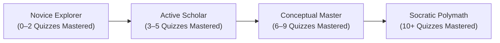
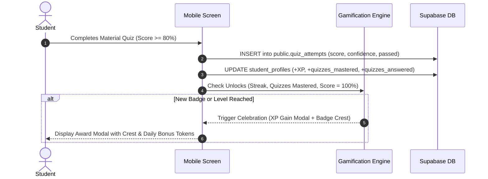
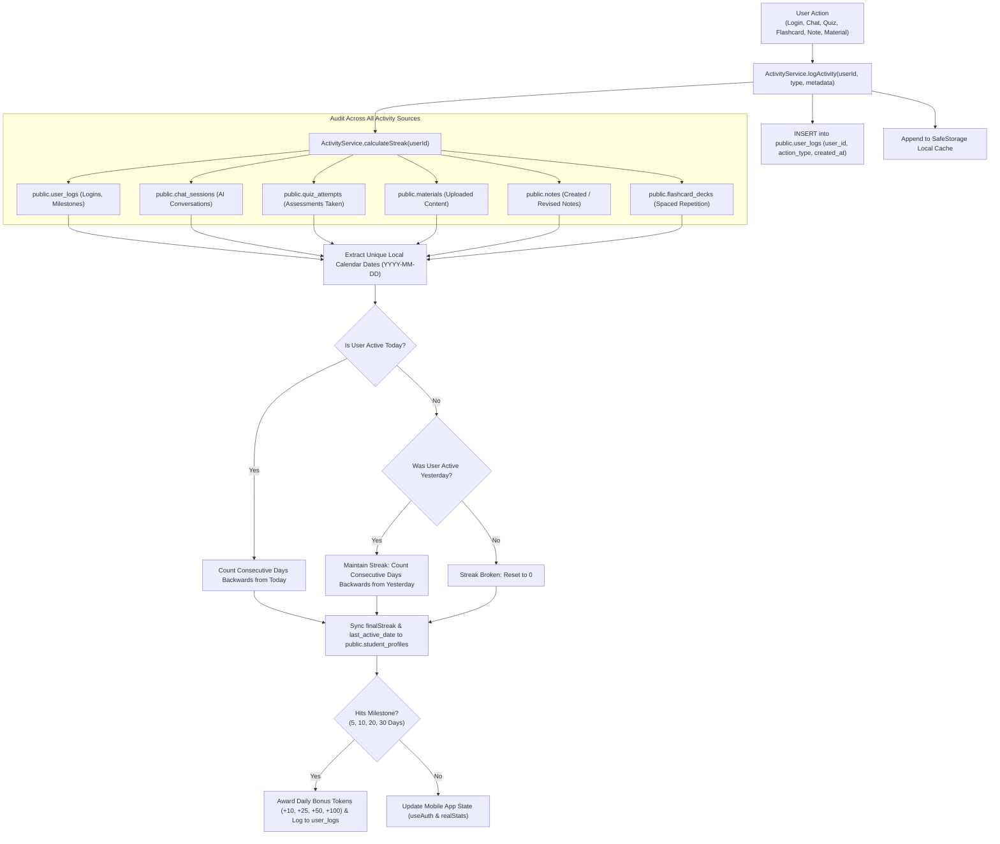

# PureLearn — Badges, Gamification & Implementation Guide

This document is the definitive reference for the **Badges & Gamification Engine**, **Understanding Level Progression**, and **All Recent Web Features** implemented on the PureLearn web platform ([`clarity-ai-tutor`](file:///Users/macbook/Documents/Dev/clarity-ai-tutor)) to be implemented on the mobile application (`purelearn.ai`).

---

## 1. Overview & Visual Aesthetic

PureLearn’s badge system moves away from generic childish stickers, using high-fidelity **academic heraldry** styled like collegiate crests, classical university seals, and honor society insignias.

* **Primary Palette**: Crisp Black (`#09090b`), Pure White (`#ffffff`), and Vibrant Socratic Orange (`#f97316` / `#ea580c`).
* **Classical Motifs**: Classical Greco-Roman pediments & columns, open scholastic books, laurel wreaths, graduation mortarboards, heraldic shields, ribbons, torches, and lightning bolts.
* **Dual State**:
  * **Unlocked**: Vibrant colors, crisp strokes, glowing orange accents.
  * **Locked**: Semi-transparent (35% opacity), greyscale desaturation, with a centered lock badge overlay.

---

## 2. Platform Badges Catalog (12 Official Badges)

| Badge ID | Display Title | Category | Description | Unlock Criteria | Reward |
| :--- | :--- | :---: | :--- | :--- | :---: |
| `5_day_streak` | **5-Day Streak** | Streak | Maintained a 5-day continuous micro-learning streak. | Study consistently for 5 consecutive calendar days. | +10 Daily Tokens<br>+100 XP |
| `10_day_streak` | **10-Day Streak** | Streak | Double-digit daily study momentum and focus. | Reach 10 consecutive calendar days. | +25 Daily Tokens<br>+250 XP |
| `20_day_streak` | **20-Day Streak** | Streak | Exceptional Socratic dedication and learning habit. | Reach 20 consecutive calendar days. | +50 Daily Tokens<br>+500 XP |
| `30_day_streak` | **30-Day Legend** | Streak | Full monthly continuous learning mastery. | Reach 30 consecutive calendar days. | +100 Daily Tokens<br>+1000 XP |
| `novice_explorer` | **Novice Explorer** | Understanding | Embarking on the conceptual discovery journey. | Complete your first material understanding quiz (Default starter). | +50 XP |
| `active_scholar` | **Active Scholar** | Understanding | Regularly tests understanding and achieves high quiz accuracy. | Master at least 3 material understanding quizzes ($\ge 80\%$). | +150 XP |
| `conceptual_master` | **Conceptual Master** | Understanding | Demonstrates deep mastery and retention of core principles. | Master at least 6 material understanding quizzes ($\ge 80\%$). | +300 XP |
| `socratic_polymath` | **Socratic Polymath** | Understanding | Highest level of conceptual synthesis across subjects. | Master at least 10 material understanding quizzes ($\ge 80\%$). | +600 XP |
| `quiz_master` | **Concept Master** | Mastery | Conquered an understanding assessment with 100% precision. | Score 100% on any material understanding quiz. | +80 XP |
| `first_flashcard_mastery` | **Flashcard Ace** | Mastery | Completed a full deck mastery review sprint. | Complete a full flashcard mastery review session. | +50 XP |
| `knowledge_investor` | **Knowledge Vault** | Mastery | Invested learning by saving key takeaways to study notes. | Save an AI tutor takeaway or riddle into study notes. | +40 XP |
| `quick_mind` | **Quick Learner** | Mastery | Completed a 1-tap micro-learning sprint. | Solve a daily brain teaser or 1-tap quick launch sprint. | +35 XP |

---

## 3. The 4-Tier Understanding Level Hierarchy

Stored in `public.student_profiles.understanding_level` and computed based on `quizzes_mastered`:



### Progression Thresholds & Calculation Function:
```typescript
export interface UnderstandingCategory {
  level: "Novice Explorer" | "Active Scholar" | "Conceptual Master" | "Socratic Polymath";
  badgeType: string;
  description: string;
  minMastered: number;
  nextThreshold: number;
  progressPercent: number;
}

export function getUnderstandingCategory(quizzesMastered: number): UnderstandingCategory {
  const count = Number(quizzesMastered || 0);

  if (count >= 10) {
    return {
      level: "Socratic Polymath",
      badgeType: "socratic_polymath",
      description: "Highest level of conceptual synthesis across subjects.",
      minMastered: 10,
      nextThreshold: 10,
      progressPercent: 100,
    };
  }
  if (count >= 6) {
    return {
      level: "Conceptual Master",
      badgeType: "conceptual_master",
      description: "Demonstrates deep mastery and retention of core principles.",
      minMastered: 6,
      nextThreshold: 10,
      progressPercent: Math.round(((count - 6) / (10 - 6)) * 100),
    };
  }
  if (count >= 3) {
    return {
      level: "Active Scholar",
      badgeType: "active_scholar",
      description: "Regularly tests understanding and achieves high quiz accuracy.",
      minMastered: 3,
      nextThreshold: 6,
      progressPercent: Math.round(((count - 3) / (6 - 3)) * 100),
    };
  }
  return {
    level: "Novice Explorer",
    badgeType: "novice_explorer",
    description: "Beginning the conceptual discovery journey.",
    minMastered: 0,
    nextThreshold: 3,
    progressPercent: Math.round((count / 3) * 100),
  };
}
```

---

## 4. Badge Unlocking Engine (Frontend Logic)

Students automatically unlock badges based on their telemetry:

```typescript
export function computeUnlockedBadges(params: {
  streak: number;
  quizzesCompleted?: number;
  quizzesMastered?: number;
  storedBadgeIds?: string[];
}): string[] {
  const ids = new Set<string>(params.storedBadgeIds || []);

  // 1. Starter default badge (always unlocked)
  ids.add("novice_explorer");

  // 2. Streaks
  const s = Number(params.streak || 0);
  if (s >= 5) ids.add("5_day_streak");
  if (s >= 10) ids.add("10_day_streak");
  if (s >= 20) ids.add("20_day_streak");
  if (s >= 30) ids.add("30_day_streak");

  // 3. Quiz mastery progression
  const m = Number(params.quizzesMastered || 0);
  if (m >= 1) ids.add("quiz_master");
  if (m >= 3) ids.add("active_scholar");
  if (m >= 6) ids.add("conceptual_master");
  if (m >= 10) ids.add("socratic_polymath");

  return Array.from(ids);
}
```

---

## 5. React Native Component Implementation

Create this file in the mobile project at `components/ui/AppBadges.tsx`:

```tsx
import React from "react";
import { View, Text, StyleSheet } from "react-native";
import Svg, {
  Path,
  Rect,
  Circle,
  G,
  Text as SvgText,
  Ellipse,
  Line,
} from "react-native-svg";
import {
  Flame,
  Zap,
  Star,
  BookOpen,
  Award,
  ShieldCheck,
  Lock,
} from "lucide-react-native";

export interface AppBadgeProps {
  type: string;
  size?: number;
  disabled?: boolean;
  showTitle?: boolean;
}

export function AppBadge({
  type,
  size = 64,
  disabled = false,
  showTitle = false,
}: AppBadgeProps) {
  const s = size;

  const renderCrest = () => {
    switch (type) {
      // ── 5-Day Streak: Heraldic Shield with Flame ──
      case "5_day_streak":
        return (
          <Svg width={s} height={s} viewBox="0 0 72 72">
            <Path d="M14 10 H58 V38 C58 52 36 63 36 63 C36 63 14 52 14 38 Z" fill="#ffffff" stroke="#09090b" strokeWidth={2.5} />
            <Path d="M18 14 H54 V37 C54 48 36 57 36 57 C36 57 18 48 18 37 Z" fill="#ffffff" stroke="#f97316" strokeWidth={1.5} />
            <Path d="M18 14 H54 V21 H18 Z" fill="#f97316" />
            <SvgText x="36" y="19" textAnchor="middle" fill="#ffffff" fontSize="5" fontWeight="900">5 DAYS</SvgText>
            {/* Flame */}
            <G x={27} y={24}>
              <Flame size={18} color="#f97316" />
            </G>
            {/* Bottom Ribbon */}
            <Path d="M8 52 L14 48 L14 56 Z" fill="#ea580c" />
            <Path d="M64 52 L58 48 L58 56 Z" fill="#ea580c" />
            <Rect x={12} y={47} width={48} height={10} rx={2} fill="#09090b" stroke="#ffffff" strokeWidth={1.2} />
            <SvgText x="36" y="54" textAnchor="middle" fill="#f97316" fontSize="5" fontWeight="900">STREAK</SvgText>
          </Svg>
        );

      // ── 10-Day Streak: Circular Seal with Lightning ──
      case "10_day_streak":
        return (
          <Svg width={s} height={s} viewBox="0 0 72 72">
            <Circle cx={36} cy={36} r={32} fill="#ffffff" stroke="#09090b" strokeWidth={2.5} />
            <Circle cx={36} cy={36} r={26} fill="#ffffff" stroke="#f97316" strokeWidth={1.5} strokeDasharray="3 2" />
            <Circle cx={36} cy={36} r={20} fill="#ffffff" stroke="#09090b" strokeWidth={1} />
            <G x={27} y={26}>
              <Zap size={18} color="#f97316" />
            </G>
            <Rect x={18} y={44} width={36} height={9} rx={1.5} fill="#09090b" stroke="#ffffff" strokeWidth={1} />
            <SvgText x="36" y="50.5" textAnchor="middle" fill="#ffffff" fontSize="4.8" fontWeight="900">10 DAYS</SvgText>
          </Svg>
        );

      // ── 20-Day Streak: Columns & Star ──
      case "20_day_streak":
        return (
          <Svg width={s} height={s} viewBox="0 0 72 72">
            <Path d="M36 4 L60 16 V38 C60 52 36 64 36 64 C36 64 12 52 12 38 V16 Z" fill="#ffffff" stroke="#09090b" strokeWidth={2.5} />
            <Path d="M36 8 L55 18 V37 C55 48 36 58 36 58 C36 58 17 48 17 37 V18 Z" fill="#ffffff" stroke="#f97316" strokeWidth={1.5} />
            <Rect x={23} y={24} width={5} height={18} fill="#09090b" rx={1} />
            <Rect x={44} y={24} width={5} height={18} fill="#09090b" rx={1} />
            <Rect x={20} y={21} width={32} height={3} fill="#f97316" rx={0.5} />
            <Rect x={20} y={42} width={32} height={3} fill="#f97316" rx={0.5} />
            <G x={28} y={26}>
              <Star size={16} color="#f97316" fill="#f97316" />
            </G>
            <Rect x={14} y={48} width={44} height={9} rx={2} fill="#09090b" stroke="#ffffff" strokeWidth={1.2} />
            <SvgText x="36" y="54.5" textAnchor="middle" fill="#f97316" fontSize="4.5" fontWeight="900">20 DAYS</SvgText>
          </Svg>
        );

      // ── 30-Day Streak: Royal Legend Crest ──
      case "30_day_streak":
        return (
          <Svg width={s} height={s} viewBox="0 0 72 72">
            <Path d="M26 12 L30 6 L36 10 L42 6 L46 12 H26 Z" fill="#f97316" stroke="#09090b" strokeWidth={1} />
            <Path d="M16 14 H56 V38 C56 52 36 63 36 63 C36 63 16 52 16 38 Z" fill="#ffffff" stroke="#09090b" strokeWidth={2.5} />
            <Path d="M20 18 H52 V37 C52 48 36 57 36 57 C36 57 20 48 20 37 Z" fill="#ffffff" stroke="#f97316" strokeWidth={1.5} />
            <Circle cx={36} cy={33} r={11} fill="#ffffff" stroke="#09090b" strokeWidth={1} />
            <SvgText x="36" y="38" textAnchor="middle" fill="#ea580c" fontSize="14" fontWeight="900">U</SvgText>
            <Rect x={10} y={47} width={52} height={10} rx={2} fill="#09090b" stroke="#f97316" strokeWidth={1.5} />
            <SvgText x="36" y="54" textAnchor="middle" fill="#ffffff" fontSize="4.8" fontWeight="900">LEGEND 30</SvgText>
          </Svg>
        );

      // ── Novice Explorer: Greco-Roman Columns ──
      case "Novice Explorer":
      case "novice_explorer":
        return (
          <Svg width={s} height={s} viewBox="0 0 72 72">
            <Path d="M14 8 H58 V38 C58 52 36 63 36 63 C36 63 14 52 14 38 Z" fill="#ffffff" stroke="#09090b" strokeWidth={2.5} />
            <Path d="M18 12 H54 V37 C54 48 36 57 36 57 C36 57 18 48 18 37 Z" fill="#ffffff" stroke="#f97316" strokeWidth={1.5} />
            <Path d="M24 22 L36 15 L48 22 Z" fill="#f97316" stroke="#09090b" strokeWidth={1} />
            <Rect x={23} y={22} width={26} height={2} fill="#09090b" />
            <Rect x={26} y={24} width={3.5} height={14} fill="#09090b" />
            <Rect x={34.25} y={24} width={3.5} height={14} fill="#09090b" />
            <Rect x={42.5} y={24} width={3.5} height={14} fill="#09090b" />
            <Rect x={23} y={38} width={26} height={3} fill="#f97316" rx={0.5} />
            <Rect x={12} y={47} width={48} height={10} rx={2} fill="#09090b" stroke="#ffffff" strokeWidth={1.2} />
            <SvgText x="36" y="54" textAnchor="middle" fill="#f97316" fontSize="4.6" fontWeight="900">EXPLORER</SvgText>
          </Svg>
        );

      // ── Active Scholar: Circular Seal with Open Book ──
      case "Active Scholar":
      case "active_scholar":
        return (
          <Svg width={s} height={s} viewBox="0 0 72 72">
            <Circle cx={36} cy={36} r={32} fill="#ffffff" stroke="#09090b" strokeWidth={2.5} />
            <Circle cx={36} cy={36} r={26} fill="#ffffff" stroke="#f97316" strokeWidth={1.5} />
            <G x={23} y={23}>
              <BookOpen size={26} color="#09090b" />
            </G>
            <Rect x={12} y={49} width={48} height={10} rx={2} fill="#09090b" stroke="#ffffff" strokeWidth={1.2} />
            <SvgText x="36" y="56" textAnchor="middle" fill="#f97316" fontSize="5" fontWeight="900">SCHOLAR</SvgText>
          </Svg>
        );

      // ── Conceptual Master: Mortarboard Graduation Crest ──
      case "Conceptual Master":
      case "conceptual_master":
        return (
          <Svg width={s} height={s} viewBox="0 0 72 72">
            <Path d="M12 12 L36 6 L60 12 V38 C60 52 36 64 36 64 C36 64 12 52 12 38 Z" fill="#ffffff" stroke="#09090b" strokeWidth={2.5} />
            <Path d="M16 15 L36 10 L56 15 V37 C56 48 36 58 36 58 C36 58 16 48 16 37 Z" fill="#ffffff" stroke="#f97316" strokeWidth={1.5} />
            <Path d="M36 18 L50 23 L36 28 L22 23 Z" fill="#09090b" stroke="#09090b" strokeWidth={1.5} />
            <Path d="M29 26 V31 C29 33 43 33 43 31 V26" fill="#09090b" stroke="#f97316" strokeWidth={1.2} />
            <Rect x={12} y={47} width={48} height={10} rx={2} fill="#09090b" stroke="#ffffff" strokeWidth={1.2} />
            <SvgText x="36" y="54" textAnchor="middle" fill="#f97316" fontSize="4.5" fontWeight="900">MASTER</SvgText>
          </Svg>
        );

      // ── Socratic Polymath: Globe & Crown Seal ──
      case "Socratic Polymath":
      case "socratic_polymath":
        return (
          <Svg width={s} height={s} viewBox="0 0 72 72">
            <Path d="M28 8 L31 4 L36 7 L41 4 L44 8 H28 Z" fill="#f97316" stroke="#09090b" strokeWidth={1} />
            <Circle cx={36} cy={36} r={32} fill="#ffffff" stroke="#09090b" strokeWidth={2.5} />
            <Circle cx={36} cy={36} r={25} fill="#ffffff" stroke="#f97316" strokeWidth={1.5} />
            <Circle cx={36} cy={33} r={12} fill="#ffffff" stroke="#f97316" strokeWidth={1.5} />
            <Ellipse cx={36} cy={33} rx={6} ry={12} stroke="#09090b" strokeWidth={1} fill="none" />
            <Line x1={24} y1={33} x2={48} y2={33} stroke="#09090b" strokeWidth={1} />
            <Rect x={11} y={50} width={50} height={10} rx={2} fill="#09090b" stroke="#ffffff" strokeWidth={1.5} />
            <SvgText x="36" y="57" textAnchor="middle" fill="#f97316" fontSize="4.6" fontWeight="900">POLYMATH</SvgText>
          </Svg>
        );

      // ── Concept Master (100% Honors): Honors Shield ──
      case "quiz_master":
        return (
          <Svg width={s} height={s} viewBox="0 0 72 72">
            <Path d="M14 8 H58 V38 C58 52 36 63 36 63 C36 63 14 52 14 38 Z" fill="#ffffff" stroke="#09090b" strokeWidth={2.5} />
            <Path d="M18 12 H54 V37 C54 48 36 57 36 57 C36 57 18 48 18 37 Z" fill="#ffffff" stroke="#f97316" strokeWidth={1.5} />
            <Circle cx={36} cy={28} r={11} fill="#09090b" stroke="#f97316" strokeWidth={1.5} />
            <Path d="M31 28 L34.5 31.5 L41.5 24.5" stroke="#ffffff" strokeWidth={2.5} strokeLinecap="round" strokeLinejoin="round" />
            <Rect x={12} y={47} width={48} height={10} rx={2} fill="#ea580c" stroke="#09090b" strokeWidth={1.2} />
            <SvgText x="36" y="54" textAnchor="middle" fill="#ffffff" fontSize="4.8" fontWeight="900">HONORS 100%</SvgText>
          </Svg>
        );

      // ── Flashcard Ace ──
      case "first_flashcard_mastery":
        return (
          <Svg width={s} height={s} viewBox="0 0 72 72">
            <Circle cx={36} cy={36} r={32} fill="#ffffff" stroke="#09090b" strokeWidth={2.5} />
            <Circle cx={36} cy={36} r={26} fill="#ffffff" stroke="#f97316" strokeWidth={1.5} strokeDasharray="3 2" />
            <G x={26} y={26}>
              <Award size={20} color="#f97316" />
            </G>
            <Rect x={14} y={48} width={44} height={9} rx={1.5} fill="#09090b" stroke="#ffffff" strokeWidth={1} />
            <SvgText x="36" y="54.5" textAnchor="middle" fill="#ffffff" fontSize="4.5" fontWeight="900">FLASHCARDS</SvgText>
          </Svg>
        );

      // ── Knowledge Vault ──
      case "knowledge_investor":
        return (
          <Svg width={s} height={s} viewBox="0 0 72 72">
            <Path d="M12 10 H60 V38 C60 52 36 63 36 63 C36 63 12 52 12 38 Z" fill="#ffffff" stroke="#09090b" strokeWidth={2.5} />
            <Path d="M16 14 H56 V37 C56 48 36 57 36 57 C36 57 16 48 16 37 Z" fill="#ffffff" stroke="#f97316" strokeWidth={1.5} />
            <G x={26} y={23}>
              <ShieldCheck size={20} color="#f97316" />
            </G>
            <Rect x={12} y={47} width={48} height={10} rx={2} fill="#09090b" stroke="#ffffff" strokeWidth={1.2} />
            <SvgText x="36" y="54" textAnchor="middle" fill="#f97316" fontSize="4.8" fontWeight="900">NOTE VAULT</SvgText>
          </Svg>
        );

      // ── Quick Learner (Default) ──
      default:
        return (
          <Svg width={s} height={s} viewBox="0 0 72 72">
            <Circle cx={36} cy={36} r={32} fill="#ffffff" stroke="#09090b" strokeWidth={2.5} />
            <Circle cx={36} cy={36} r={25} fill="#ffffff" stroke="#f97316" strokeWidth={1.5} />
            <G x={27} y={26}>
              <Zap size={18} color="#f97316" />
            </G>
            <Rect x={16} y={48} width={40} height={9} rx={1.5} fill="#ea580c" stroke="#09090b" strokeWidth={1} />
            <SvgText x="36" y="54.5" textAnchor="middle" fill="#ffffff" fontSize="4.6" fontWeight="900">SPRINT</SvgText>
          </Svg>
        );
    }
  };

  return (
    <View style={[styles.container, disabled && styles.disabledContainer]}>
      {renderCrest()}
      {disabled && (
        <View style={styles.lockOverlay}>
          <View style={styles.lockCircle}>
            <Lock size={12} color="#ffffff" strokeWidth={2.5} />
          </View>
        </View>
      )}
      {showTitle && (
        <Text style={styles.titleText} numberOfLines={1}>
          {type.replace(/_/g, " ").toUpperCase()}
        </Text>
      )}
    </View>
  );
}

const styles = StyleSheet.create({
  container: {
    alignItems: "center",
    justifyContent: "center",
    position: "relative",
  },
  disabledContainer: {
    opacity: 0.35,
  },
  lockOverlay: {
    ...StyleSheet.absoluteFillObject,
    alignItems: "center",
    justifyContent: "center",
  },
  lockCircle: {
    width: 22,
    height: 22,
    borderRadius: 11,
    backgroundColor: "rgba(0, 0, 0, 0.85)",
    borderWidth: 1,
    borderColor: "rgba(255, 255, 255, 0.4)",
    alignItems: "center",
    justifyContent: "center",
  },
  titleText: {
    marginTop: 4,
    fontSize: 10,
    fontWeight: "800",
    color: "#a1a1aa",
    textAlign: "center",
  },
});
```

---

## 6. How Badges Work: Lifecycle & Event Triggers



### Event Trigger Matrix:

| Event Trigger | Associated Badge | Database Effect |
| :--- | :--- | :--- |
| **Quiz Completed (Score = 100%)** | `quiz_master` ("Concept Master") | `quiz_attempts.score = 100.0`, `student_profiles.xp += 80` |
| **Quiz Mastered (Score $\ge 80\%$)** | `active_scholar`, `conceptual_master`, `socratic_polymath` | `quizzes_mastered += 1`, updates `understanding_level` string |
| **Study Streak Reaches 5, 10, 20, 30** | `5_day_streak`, `10_day_streak`, `20_day_streak`, `30_day_streak` | `student_profiles.streak`, awards +10 to +100 `daily_bonus_tokens` |
| **Full Flashcard Deck Completed** | `first_flashcard_mastery` | `student_profiles.xp += 50` |
| **AI Tutor Takeaway Saved to Note** | `knowledge_investor` | `notes.is_ai_generated = true`, `student_profiles.xp += 40` |
| **Daily Brain Teaser / Quick Sprint** | `quick_mind` | `student_profiles.xp += 35` |

---

## 7. Documented Web Changes to Port to Mobile

Below are all corresponding database and architectural changes completed on the web platform that should be mirrored on the mobile app:

### 1. Schema & Column Alignment in `lib/supabase-service.ts`
* **Subscriptions**: Query `plan_tier` (`'free'`, `'pro'`, `'educator'`) and `status` (`'active'`, `'trialing'`, `'canceled'`) instead of `plan_name`.
* **Telemetry Counters**: Read and sync `quizzes_mastered`, `quizzes_answered`, `quizzes_failed`, and `understanding_level` from `student_profiles`.

### 2. Quota Check on Mobile Chat (`app/(tabs)/index.tsx`)
* Before calling Gemini API in chat, execute:
  ```typescript
  const { data, error } = await supabase.rpc("check_and_consume_prompt", {
    p_user_id: user.id,
  });
  ```
* If `data.allowed === false`, intercept dispatch and show an upgrade prompt alert (`Free Plan: 5/5 monthly prompts used`).

### 3. Material Quiz Modal in `app/materials/[id].tsx`
* Add an action button `"Take Quiz"` to the material screen.
* Generate a 5-question multiple choice assessment grounded in `material.content`.
* Record result to `quiz_attempts` with `student_id`, `material_id`, `score`, and `confidence_level` (1 to 5).

### 4. Profile Achievements Grid in `app/(tabs)/profile.tsx`
* Replace placeholder text badges with a 3x4 grid rendering `<AppBadge />` for each badge in `ALL_PLATFORM_BADGES`.
* Tapping a badge opens a detail modal showing the Title, Description, Status (Earned vs Locked), and Unlock Criteria.

---

## 8. Actual Streak Tracking & Activity Logging Engine

To prevent streaks from getting out of sync, resetting incorrectly, or artificially inflating, PureLearn employs a verified **system activity ledger**:



### 1. Database Persistence via `public.user_logs`
Every user event triggers an audit record in `public.user_logs`:
```sql
-- Table definition in supabase/schema.sql
CREATE TABLE IF NOT EXISTS public.user_logs (
    id UUID DEFAULT gen_random_uuid() PRIMARY KEY,
    user_id UUID REFERENCES public.profiles(id) ON DELETE CASCADE NOT NULL,
    action_type TEXT NOT NULL, -- 'login', 'chat', 'quiz', 'note', 'material', 'flashcard'
    details TEXT,
    device_info TEXT,
    created_at TIMESTAMP WITH TIME ZONE DEFAULT timezone('utc'::text, now()) NOT NULL
);
```

### 2. Multi-Table Activity Check
Rather than relying on a single mutable integer, `calculateStreak(userId)` queries:
1. `user_logs`: `created_at, action_type`
2. `chat_sessions`: `created_at`
3. `quiz_attempts`: `created_at, completed_at`
4. `materials`: `created_at`
5. `notes`: `created_at, updated_at`
6. `flashcard_decks`: `created_at, updated_at`
7. `student_profiles`: `last_active_date, streak`
8. Local device cache (`SafeStorage`)

### 3. Local Timezone Date Normalization
All timestamps are parsed using `getLocalDateString(new Date(timestamp))` to prevent UTC midnight rollover anomalies from breaking streaks across timezones.

### 4. Continuous Day Verification
* **Active Today (`todayActive = true`)**: The streak counter decrements day-by-day starting from today. As long as `dateSet.has(checkDate)`, `consecutiveStreak++`.
* **Active Yesterday (`yesterdayActive = true`, but not yet today)**: The user is still within their 24-hour study window. The streak from yesterday is preserved.
* **Neither Today nor Yesterday**: The user skipped at least one full calendar day. The streak resets to 0 (and increments to 1 as soon as an action is completed today).

