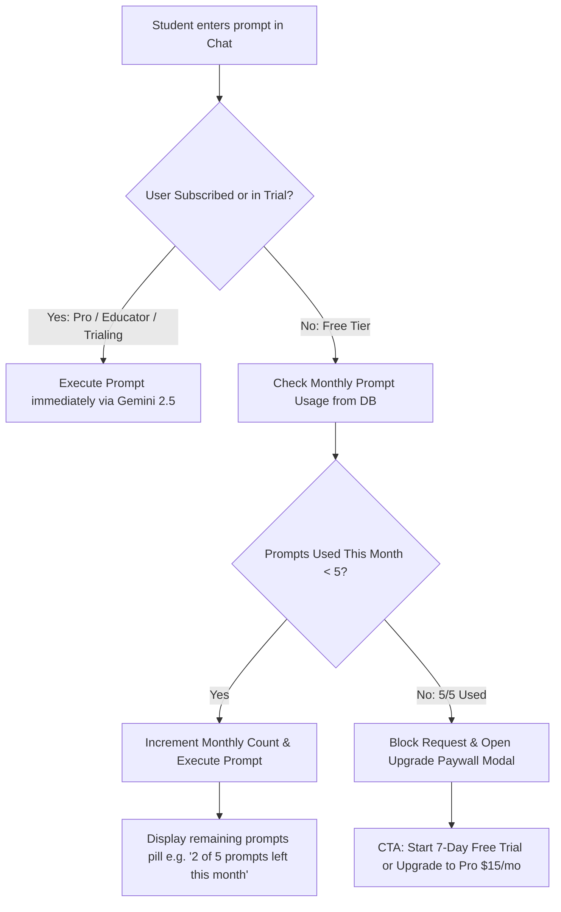
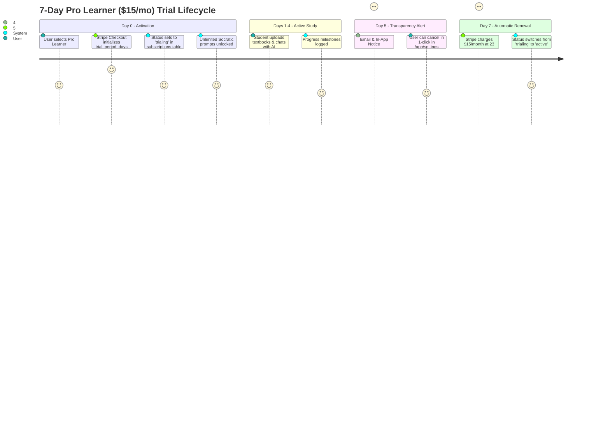

# PureLearn.ai — Future Integrations: Payments, Subscriptions & 7-Day Free Trial Architecture

This specification outlines the technical, database, and financial architecture for implementing **Payments**, **Subscriptions**, the **7-Day Free Trial**, and the **5 Prompts/Month Free Tier Enforcement** in PureLearn.ai.

All pricing models in this document match the official PureLearn pricing table ([`src/routes/pricing.tsx`](file:///Users/macbook/Documents/Dev/clarity-ai-tutor/src/routes/pricing.tsx) / [https://purelearn.vigilance.rw/pricing](https://purelearn.vigilance.rw/pricing)).

---

## 1. Official Pricing Tiers & Entitlements Matrix

PureLearn employs a **freemium Product-Led Growth (PLG) + educator seat licensing** model:

| Plan | Price | Target Audience | AI Prompt Allowance | Core Feature Set |
| :--- | :---: | :---: | :---: | :--- |
| **Free Tier** | **$0 / lifetime** | Test-driving Socratic tutoring | **Strictly 5 prompts / calendar month** | • 3 Active Documents<br>• ADHD & Dyslexia tools<br>• Basic Quiz generator |
| **Pro Learner** *(Recommended)* | **$15 / month** | Ambitious students & power learners | **Unlimited AI Socratic Prompts** | • Unlimited Documents & Notes<br>• LaTeX Formula rendering<br>• AI Image OCR extraction<br>• Double Streak multipliers<br>• 7-Day Free Trial |
| **Educator / Custom** | **$9 base + seat volume** | Teachers, schools & departments | **Unlimited Class Prompts** | • Isolated Classroom Hub<br>• Socratic Sandbox Prompt tuning<br>• Verified educator status<br>• Classroom struggle heatmaps |

### 1.1 Educator Custom Seat Pricing Formula
The Educator plan features dynamic seat-based pricing with volume discounts:
$$\text{Total Monthly Price} = \$9 + (\text{Student Seats} \times \text{Rate})$$

| Student Seat Bracket | Rate per Student Seat / Month | Example Monthly Total |
| :--- | :---: | :---: |
| **10 – 200 seats** | **$0.12** / seat | 100 seats = **$21 / month** ($9 + $12) |
| **201 – 500 seats** | **$0.10** / seat | 300 seats = **$39 / month** ($9 + $30) |
| **501 – 1,000+ seats** | **$0.08** / seat | 1,000 seats = **$89 / month** ($9 + $80) |

---

## 2. The 5 Prompts/Month Free Tier Quota Architecture

### 2.1 Rule Definition
- **Non-subscribed users (Free Tier)** receive **5 Socratic AI prompts per calendar month**.
- The quota resets on the **1st day of every month at 00:00 UTC**.
- When a user submits their 5th prompt, their monthly quota is exhausted. Subsequent attempts to send messages to the AI tutor are blocked by a paywall modal pointing them to upgrade to **Pro Learner ($15/mo)** or start the **7-Day Free Trial**.
- Subscribed users (`status = 'active'` or `status = 'trialing'`) have **unlimited prompts**.

### 2.2 User Quota State Machine & UI Flow



---

## 3. Database Schema for Monthly Prompt Tracking & Subscriptions

Run this schema extension in Supabase to enforce prompt limits and subscriptions:

```sql
-- 1. Subscription Plan Enum
CREATE TYPE subscription_tier AS ENUM ('free', 'pro', 'educator');
CREATE TYPE subscription_status AS ENUM ('trialing', 'active', 'past_due', 'canceled', 'unpaid');

-- 2. Subscriptions Table
CREATE TABLE IF NOT EXISTS public.subscriptions (
  id UUID PRIMARY KEY DEFAULT gen_random_uuid(),
  user_id UUID REFERENCES public.profiles(id) ON DELETE CASCADE NOT NULL UNIQUE,
  stripe_customer_id TEXT UNIQUE,
  stripe_subscription_id TEXT UNIQUE,
  plan_tier subscription_tier NOT NULL DEFAULT 'free',
  status subscription_status NOT NULL DEFAULT 'active',
  seats_count INTEGER DEFAULT 0, -- Used for Educator plans
  trial_start TIMESTAMPTZ,
  trial_end TIMESTAMPTZ,
  current_period_start TIMESTAMPTZ NOT NULL DEFAULT now(),
  current_period_end TIMESTAMPTZ NOT NULL DEFAULT (now() + INTERVAL '1 month'),
  cancel_at_period_end BOOLEAN NOT NULL DEFAULT false,
  created_at TIMESTAMPTZ NOT NULL DEFAULT now(),
  updated_at TIMESTAMPTZ NOT NULL DEFAULT now()
);

ALTER TABLE public.subscriptions ENABLE ROW LEVEL SECURITY;

CREATE POLICY "Users can view own subscription"
  ON public.subscriptions FOR SELECT
  TO authenticated
  USING (user_id = auth.uid());

CREATE POLICY "Admins have full access to subscriptions"
  ON public.subscriptions FOR ALL
  TO authenticated
  USING (
    EXISTS (SELECT 1 FROM public.profiles WHERE id = auth.uid() AND role = 'admin')
  );

-- 3. Monthly Prompt Tracking Ledger
CREATE TABLE IF NOT EXISTS public.user_monthly_prompts (
  id UUID PRIMARY KEY DEFAULT gen_random_uuid(),
  user_id UUID REFERENCES public.profiles(id) ON DELETE CASCADE NOT NULL,
  year_month TEXT NOT NULL, -- Format: 'YYYY-MM' e.g. '2026-09'
  prompt_count INTEGER NOT NULL DEFAULT 0,
  updated_at TIMESTAMPTZ NOT NULL DEFAULT now(),
  CONSTRAINT unique_user_month UNIQUE (user_id, year_month)
);

ALTER TABLE public.user_monthly_prompts ENABLE ROW LEVEL SECURITY;

CREATE POLICY "Users can view own prompt count"
  ON public.user_monthly_prompts FOR SELECT
  TO authenticated
  USING (user_id = auth.uid());

-- 4. Atomic PostgreSQL Function to Check & Consume Prompt Quota
CREATE OR REPLACE FUNCTION public.check_and_consume_prompt(p_user_id UUID)
RETURNS JSONB
LANGUAGE plpgsql
SECURITY DEFINER
SET search_path = public
AS $$
DECLARE
  v_sub RECORD;
  v_current_month TEXT;
  v_count INTEGER;
  v_max_free_prompts CONSTANT INTEGER := 5;
BEGIN
  -- Check user's active subscription tier
  SELECT plan_tier, status, trial_end INTO v_sub
  FROM public.subscriptions
  WHERE user_id = p_user_id;

  -- If user has an active Pro or Educator plan, or active 7-Day trial -> Unlimited prompts
  IF FOUND AND (
    (v_sub.status = 'active' AND v_sub.plan_tier IN ('pro', 'educator')) OR
    (v_sub.status = 'trialing' AND v_sub.trial_end > now())
  ) THEN
    RETURN jsonb_build_object(
      'allowed', true,
      'is_unlimited', true,
      'plan_tier', v_sub.plan_tier,
      'prompts_remaining', -1
    );
  END IF;

  -- Free Tier user: Check current calendar month usage
  v_current_month := to_char(now() AT TIME ZONE 'UTC', 'YYYY-MM');

  -- Upsert monthly prompt row
  INSERT INTO public.user_monthly_prompts (user_id, year_month, prompt_count, updated_at)
  VALUES (p_user_id, v_current_month, 0, now())
  ON CONFLICT (user_id, year_month) DO NOTHING;

  SELECT prompt_count INTO v_count
  FROM public.user_monthly_prompts
  WHERE user_id = p_user_id AND year_month = v_current_month;

  -- Quota check: 5 prompts allowed per month
  IF v_count >= v_max_free_prompts THEN
    RETURN jsonb_build_object(
      'allowed', false,
      'is_unlimited', false,
      'plan_tier', 'free',
      'prompts_used', v_count,
      'prompts_limit', v_max_free_prompts,
      'prompts_remaining', 0,
      'resets_at', (date_trunc('month', now() AT TIME ZONE 'UTC') + INTERVAL '1 month')::DATE
    );
  END IF;

  -- Consume 1 prompt atomically
  UPDATE public.user_monthly_prompts
  SET prompt_count = prompt_count + 1, updated_at = now()
  WHERE user_id = p_user_id AND year_month = v_current_month
  RETURNING prompt_count INTO v_count;

  RETURN jsonb_build_object(
    'allowed', true,
    'is_unlimited', false,
    'plan_tier', 'free',
    'prompts_used', v_count,
    'prompts_limit', v_max_free_prompts,
    'prompts_remaining', v_max_free_prompts - v_count
  );
END;
$$;
```

---

## 4. Frontend Integration: Prompt Quota Guard & Paywall

### 4.1 Client Hook (`src/hooks/usePromptQuota.ts`)

```tsx
import { useState, useEffect } from "react";
import { supabase } from "@/lib/supabase";

export interface PromptQuotaStatus {
  allowed: boolean;
  isUnlimited: boolean;
  promptsUsed: number;
  promptsLimit: number;
  promptsRemaining: number;
  planTier: string;
  loading: boolean;
}

export function usePromptQuota() {
  const [quota, setQuota] = useState<PromptQuotaStatus>({
    allowed: true,
    isUnlimited: false,
    promptsUsed: 0,
    promptsLimit: 5,
    promptsRemaining: 5,
    planTier: "free",
    loading: true,
  });

  const checkQuota = async (): Promise<boolean> => {
    const { data: { session } } = await supabase.auth.getSession();
    if (!session?.user) return false;

    const { data, error } = await supabase.rpc("check_and_consume_prompt", {
      p_user_id: session.user.id,
    });

    if (error || !data) return false;

    setQuota({
      allowed: data.allowed,
      isUnlimited: data.is_unlimited,
      promptsUsed: data.prompts_used || 0,
      promptsLimit: data.prompts_limit || 5,
      promptsRemaining: data.prompts_remaining ?? 0,
      planTier: data.plan_tier || "free",
      loading: false,
    });

    return data.allowed;
  };

  return { quota, checkQuota };
}
```

### 4.2 Chat Prompt Bar & Paywall Modal (`src/routes/app.index.tsx`)
When rendering the tutor message input:
1. Show a pill indicator for Free users:
   > `✨ Free Plan: 2 / 5 prompts remaining this month`
2. Before calling `streamGeminiText()` or `generateGeminiText()`, execute `const allowed = await checkQuota()`.
3. If `allowed === false`:
   - Open `<UpgradeModal />` showing:
     - **"You've reached your free monthly limit (5/5 prompts)"**
     - **Button**: `"Upgrade to Pro ($15/mo)"` or `"Start 7-Day Free Trial"`

---

## 5. The 7-Day Free Trial Workflow for Pro Learner ($15/mo)

### 5.1 Trial Lifecycle & Conversion Journey



### 5.2 Automated Trial Notifications
1. **Day 0**: *"Welcome to PureLearn Pro! Your 7 days of unlimited Socratic tutoring are now active."*
2. **Day 3**: *"Milestone: You've mastered 3 key concepts. Check out custom LaTeX quizzes."*
3. **Day 5**: *"Reminder: Your free trial ends in 48 hours. Continue unlimited access for $15/month."*
4. **Day 7**: *"Receipt: Your $15 Pro Learner subscription is active. Keep learning smarter."*

---

## 6. Stripe Webhooks & Plan IDs Mapping

### 6.1 Stripe Price IDs
- **Pro Learner Monthly**: `price_pro_monthly_15usd` ($15.00 / month, 7 days trial).
- **Educator Base Plan**: `price_educator_base_9usd` ($9.00 / month base).
- **Educator Student Seat Tier**: `price_educator_seat_metered` (Metered usage or licensed seats: $0.12, $0.10, $0.08 / seat).

### 6.2 Webhook Event Handlers (Supabase Edge Function `stripe-webhook`)

| Stripe Event | Handled Action in Database |
| :--- | :--- |
| `checkout.session.completed` | Sets `public.subscriptions` with `plan_tier = 'pro'`, `status = 'trialing'`, and `trial_end = now() + interval '7 days'`. |
| `customer.subscription.updated` | Updates `status` (`active`, `past_due`, `canceled`) and `current_period_end`. |
| `customer.subscription.deleted` | Downgrades `plan_tier` to `'free'`. The user immediately reverts to the 5 prompts/month limit. |
| `invoice.payment_succeeded` | Records payment and renews the monthly period. |
| `invoice.payment_failed` | Sets `status = 'past_due'`. Triggers a 48-hour grace period warning banner in `/app`. |

---

## 7. Implementation Checklist for Future Engineering

- [ ] **Step 1: Run Database Migration**: Execute the SQL in Section 3 in Supabase to create `subscriptions`, `user_monthly_prompts`, and the `check_and_consume_prompt()` function.
- [ ] **Step 2: Deploy Stripe Edge Functions**:
  - `create-checkout-session`: Configured with price ID `price_pro_monthly_15usd` and `trial_period_days: 7`.
  - `create-portal-session`: Generates customer self-service billing link.
  - `stripe-webhook`: Verifies Stripe signatures and syncs subscription state.
- [ ] **Step 3: Connect Frontend Quota Guard**:
  - Add `usePromptQuota()` hook in `src/hooks/usePromptQuota.ts`.
  - Intercept the message send button in `src/routes/app.index.tsx` to call `checkQuota()` before dispatching to Gemini.
- [ ] **Step 4: Connect Pricing Page Checkout**:
  - In `src/routes/pricing.tsx`, connect the `"Upgrade Now"` button ($15/mo) to call `create-checkout-session`.
  - Connect the Educator seat slider (`$9 base + volume seats`) to create an enterprise inquiry or Stripe seat checkout.
- [ ] **Step 5: Add In-App Quota Banner & Upgrade Modal**:
  - Show remaining free prompts count pill (`X / 5 left this month`).
  - Render upgrade modal when free quota is reached.
