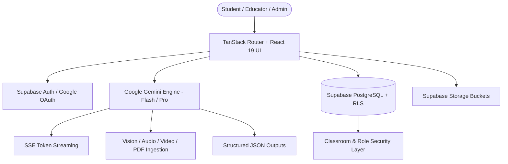

# Purelearn.ai (Clarity AI Tutor) — System Architecture, Routes & Features Guide

---

## 1. System Overview & Vision

**Purelearn.ai** (internally configured as *Clarity AI Tutor*) is an advanced, neuro-inclusive AI-powered learning environment engineered to transform academic studying into a deeply interactive, structured, and personalized experience. 

Designed conceptually as a specialized **"Notion for Learning + Socratic AI Tutor"**, Purelearn combines conversational artificial intelligence directly with an academic-grade rich text editor, real-time LaTeX typesetting, multimodal document processing, adaptive cognitive styling, and institutional classroom tools.



---

## 2. Technology Stack & Infrastructure

### 2.1 Core Technologies

| Layer | Technology | Purpose & Capabilities |
| :--- | :--- | :--- |
| **Runtime & Bundler** | Vite 8 + TypeScript 5.8 | High-speed ESM bundling, type safety, and development server. |
| **Frontend Framework** | React 19 | Modern UI rendering, concurrent features, and hooks architecture. |
| **Routing Engine** | `@tanstack/react-router` (v1.170) | Fully type-safe, client-side & SSR-ready file-based routing with automatic tree generation. |
| **Data Fetching & State** | `@tanstack/react-query` (v5.101) | Asynchronous query caching, mutations, and optimistic updates. |
| **Styling & Design System** | Tailwind CSS v4 + Radix UI + Lucide Icons | Utility-first responsive styling, accessible primitives, glassmorphism, and dark/light modes. |
| **Math & Typography Engine** | KaTeX 0.17 | Sub-millisecond server/client mathematical equation, matrix, and formula rendering with MathML copy protection. |
| **AI Cognitive Engine** | Google Gemini API (`gemini-2.5-flash`, `gemini-3.5-flash-lite`) | Socratic dialogue, real-time SSE chunk streaming, multimodal analysis, and JSON schema extraction. |
| **Backend & Database** | Supabase (PostgreSQL 15+) | Authentication, Row Level Security (RLS), encrypted messaging tables, and Postgres Functions. |
| **Object Storage** | Supabase Storage | File storage for student avatars, lecture recordings, PDFs, slides, and study assets. |
| **Email & Communications** | Resend & Twilio API | Transactional emails, account notifications, and communication dispatch. |
| **Charts & Telemetry** | Recharts 2.15 | Visual analytics for study streaks, confidence distributions, and quiz performance metrics. |

---

## 3. Application Routes & Navigation Map

The routing architecture is built on TanStack Router with strict file-based routing (`src/routes/`). Below is the complete catalog of all application endpoints.

### 3.1 Public & Marketing Routes

| Route | File Path | Description | Key Features |
| :--- | :--- | :--- | :--- |
| `/` | [`src/routes/index.tsx`](file:///Users/macbook/Documents/Dev/clarity-ai-tutor/src/routes/index.tsx) | Landing Page & Hero | Dynamic product tour, feature teasers, partner badges, testimonials, and Call to Actions. |
| `/features` | [`src/routes/features.tsx`](file:///Users/macbook/Documents/Dev/clarity-ai-tutor/src/routes/features.tsx) | Features Showcase | Deep dive into the Dual-Pane Workspace, Cognitive Rendering, LaTeX Editor, and AI Quizzes. |
| `/pricing` | [`src/routes/pricing.tsx`](file:///Users/macbook/Documents/Dev/clarity-ai-tutor/src/routes/pricing.tsx) | Subscription Plans | Free, Pro Student, and Institutional / School tier breakdown with feature comparison. |
| `/blog` | [`src/routes/blog.tsx`](file:///Users/macbook/Documents/Dev/clarity-ai-tutor/src/routes/blog.tsx) | Educational Articles | Insights on neurodivergent learning strategies, STEM study methods, and AI in education. |
| `/community` | [`src/routes/community.tsx`](file:///Users/macbook/Documents/Dev/clarity-ai-tutor/src/routes/community.tsx) | Student Community Hub | Study group information, discord links, shared public decks, and partner academies. |
| `/changelog` | [`src/routes/changelog.tsx`](file:///Users/macbook/Documents/Dev/clarity-ai-tutor/src/routes/changelog.tsx) | Release Notes | Version history, recent feature shipments, performance upgrades, and bug fixes. |
| `/contact` | [`src/routes/contact.tsx`](file:///Users/macbook/Documents/Dev/clarity-ai-tutor/src/routes/contact.tsx) | Support & Inquiries | Contact form, partner school inquiries, and support ticket submissions. |
| `/privacy` | [`src/routes/privacy.tsx`](file:///Users/macbook/Documents/Dev/clarity-ai-tutor/src/routes/privacy.tsx) | Privacy Policy | Detailed student data protection guidelines, AI context siloing, and encryption protocols. |
| `/terms` | [`src/routes/terms.tsx`](file:///Users/macbook/Documents/Dev/clarity-ai-tutor/src/routes/terms.tsx) | Terms of Service | Acceptable use policies, academic integrity guidelines, and account terms. |
| `/gdpr` | [`src/routes/gdpr.tsx`](file:///Users/macbook/Documents/Dev/clarity-ai-tutor/src/routes/gdpr.tsx) | GDPR Compliance | Data portability, right to erasure, and European privacy compliance disclosures. |

---

### 3.2 Authentication & Onboarding Routes

| Route | File Path | Description | Key Features |
| :--- | :--- | :--- | :--- |
| `/auth/sign-in` | [`src/routes/auth.sign-in.tsx`](file:///Users/macbook/Documents/Dev/clarity-ai-tutor/src/routes/auth.sign-in.tsx) | User Login | Email/Password login, Google OAuth one-click authentication, and session initialization. |
| `/auth/sign-up` | [`src/routes/auth.sign-up.tsx`](file:///Users/macbook/Documents/Dev/clarity-ai-tutor/src/routes/auth.sign-up.tsx) | Account Creation | Quick registration with role selection (Student vs. Educator). |
| `/auth/forgot-password` | [`src/routes/auth.forgot-password.tsx`](file:///Users/macbook/Documents/Dev/clarity-ai-tutor/src/routes/auth.forgot-password.tsx) | Password Recovery | Generates secure password reset emails via Supabase Auth. |
| `/auth/reset-password` | [`src/routes/auth.reset-password.tsx`](file:///Users/macbook/Documents/Dev/clarity-ai-tutor/src/routes/auth.reset-password.tsx) | Password Update | Secure token validation and new password submission interface. |
| `/register/student` | [`src/routes/register.student.tsx`](file:///Users/macbook/Documents/Dev/clarity-ai-tutor/src/routes/register.student.tsx) | Student Onboarding | Multi-step setup: academic level, grade, study goals, cognitive profile selection (ADHD/Dyslexia/Standard). |
| `/register/teacher` | [`src/routes/register.teacher.tsx`](file:///Users/macbook/Documents/Dev/clarity-ai-tutor/src/routes/register.teacher.tsx) | Educator Onboarding | Institution verification, subject specialty, and initial classroom configuration. |

---

### 3.3 Student Workspace Routes (`/app/*`)

| Route | File Path | Description | Key Capabilities |
| :--- | :--- | :--- | :--- |
| `/app/` | [`src/routes/app.index.tsx`](file:///Users/macbook/Documents/Dev/clarity-ai-tutor/src/routes/app.index.tsx) | AI Study Studio | Dual-pane split view combining Socratic AI Chat with the Live Notebook, prompt suggestions, LaTeX rendering, and "Save to Notes". |
| `/app/notes` | [`src/routes/app.notes.tsx`](file:///Users/macbook/Documents/Dev/clarity-ai-tutor/src/routes/app.notes.tsx) | Digital Notebook | Rich Markdown/KaTeX editor, note categories, pinning, full-text search, and email-based note collaboration. |
| `/app/flashcards` | [`src/routes/app.flashcards.tsx`](file:///Users/macbook/Documents/Dev/clarity-ai-tutor/src/routes/app.flashcards.tsx) | Flashcard Studio | Interactive 3D flip study decks, spaced repetition difficulty ratings (Again, Hard, Good, Easy), AI deck generation. |
| `/app/teasers` | [`src/routes/app.teasers.tsx`](file:///Users/macbook/Documents/Dev/clarity-ai-tutor/src/routes/app.teasers.tsx) | Cognitive Brain Teasers | Daily adaptive logic puzzles, mathematical teasers, streak tracking, XP awards, and step-by-step AI hints. |
| `/app/library` | [`src/routes/app.library.tsx`](file:///Users/macbook/Documents/Dev/clarity-ai-tutor/src/routes/app.library.tsx) | Study Material Hub | Upload manager for PDFs, DOCX, PPTX, MP3/WAV, MP4, and YouTube links with auto-generated AI study notes. |
| `/app/documents/$id` | [`src/routes/app.documents.$id.tsx`](file:///Users/macbook/Documents/Dev/clarity-ai-tutor/src/routes/app.documents.$id.tsx) | Document Study Room | Dedicated focus reader for a specific material with contextual AI questioning, instant summaries, and key concept highlights. |
| `/app/analytics` | [`src/routes/app.analytics.tsx`](file:///Users/macbook/Documents/Dev/clarity-ai-tutor/src/routes/app.analytics.tsx) | Learning Telemetry | Visual dashboard showing study streaks, XP milestones, self-rated confidence vs. quiz scores, and subject breakdown. |
| `/app/settings` | [`src/routes/app.settings.tsx`](file:///Users/macbook/Documents/Dev/clarity-ai-tutor/src/routes/app.settings.tsx) | Preferences & Accessibility | Cognitive rendering toggles (Bionic reading, OpenDyslexic font, pastel sepia/cream tints), avatar upload, and security settings. |

---

### 3.4 Educator Cockpit (`/teacher/*`)

| Route | File Path | Description | Key Capabilities |
| :--- | :--- | :--- | :--- |
| `/teacher/` | [`src/routes/teacher.index.tsx`](file:///Users/macbook/Documents/Dev/clarity-ai-tutor/src/routes/teacher.index.tsx) | Educator Command Center | Manage classrooms, student enrollments, curriculum materials, AI quiz builder, and student mastery telemetry. |

---

### 3.5 Global Admin Control Plane (`/admin/*`)

| Route | File Path | Description | Key Capabilities |
| :--- | :--- | :--- | :--- |
| `/admin/` | [`src/routes/admin.index.tsx`](file:///Users/macbook/Documents/Dev/clarity-ai-tutor/src/routes/admin.index.tsx) | System Operations Dashboard | Manage user roles & approvals, inspect system audit logs, configure global Gemini API keys in DB, and review subscription metrics. |

---

### 3.6 Root, Layouts & Fallbacks

| Route | File Path | Description |
| :--- | :--- | :--- |
| Root | [`src/routes/__root.tsx`](file:///Users/macbook/Documents/Dev/clarity-ai-tutor/src/routes/__root.tsx) | Global layout wrapper, theme provider, global keyboard shortcuts, and meta tags. |
| 404 Splat | [`src/routes/$.tsx`](file:///Users/macbook/Documents/Dev/clarity-ai-tutor/src/routes/$.tsx) | Dynamic catch-all route rendering [`NotFoundPage`](file:///Users/macbook/Documents/Dev/clarity-ai-tutor/src/components/NotFoundPage.tsx). |

---

## 4. Key Systems & Architectural Features

### 4.1 Dual-Pane Socratic AI Workspace
The primary learning interface ([`src/routes/app.index.tsx`](file:///Users/macbook/Documents/Dev/clarity-ai-tutor/src/routes/app.index.tsx)) integrates a split-pane layout:
1. **Left / Chat Pane:** Live Socratic AI tutor that avoids direct answer handouts, opting to guide students with step-by-step hints, Socratic questions, and concept breakdowns.
2. **Right / Note Pane:** A persistent rich text and LaTeX editor where AI explanations can be pushed immediately with the **"Save to Notes"** button.
3. **Session Memory:** Each session retains conversation context, active study material references, and message history.

```
+------------------------------------+------------------------------------+
|          AI CHAT PANE              |          NOTEBOOK PANE             |
|                                    |                                    |
| [Student]: How does Bayes' Rule    | # Probability Notes                |
|            work?                   |                                    |
| [AI Tutor]: Let's start with prior | $$P(A|B) = \frac{P(B|A)P(A)}{P(B)}$$|
|            probability. What do... |                                    |
| [Save to Notes] [Generate Flashcard]| - P(A): Prior probability          |
+------------------------------------+------------------------------------+
```

---

### 4.2 Academic-Grade Rich Editor & LaTeX Math Engine
The system features a custom rich editor ([`src/components/rich-editor.tsx`](file:///Users/macbook/Documents/Dev/clarity-ai-tutor/src/components/rich-editor.tsx)) and Markdown renderer ([`src/components/markdown.tsx`](file:///Users/macbook/Documents/Dev/clarity-ai-tutor/src/components/markdown.tsx)):
- **KaTeX Equations:** Inline math (`$E=mc^2$`) and block math (`$$\int_{a}^{b} f(x)dx$$`) render at 60fps without layout shifts.
- **MathML Copy Preservation:** Math elements are annotated with underlying TeX strings so copying rendered equations preserves the raw LaTeX code on the clipboard.
- **Markdown Tables & Callouts:** Renders academic tables, info alerts, and code blocks with syntax highlighting.
- **HTML Sanitization:** Prevents script execution while preserving MathML and SVG formatting.

---

### 4.3 Adaptive Cognitive Rendering Engine
Engineered specifically for neurodivergent learners:
- **ADHD Profile (Bionic Reading):** Dynamically bolds the initial letters of each word across study text to guide saccadic eye movements and minimize fixation fatigue.
- **Dyslexia Profile:** Activates specialized dyslexic-friendly font faces, increased line-height (leading), and calibrated letter spacing (kerning) to eliminate visual crowding.
- **Sensory Pastel Tinting:** Applies soft sepia, cream, or pastel yellow overlays to reduce eye strain and contrast sensitivity.

---

### 4.4 Multimodal Learning Material Pipeline
The material ingestion engine ([`src/lib/learning-materials.ts`](file:///Users/macbook/Documents/Dev/clarity-ai-tutor/src/lib/learning-materials.ts)) handles:
- **PDF & Word Documents:** Extracts academic theory, definitions, and formulas into structured markdown notes.
- **Images & Diagrams:** Performs vision-based AI decomposition of diagrams, flowcharts, and equations.
- **Audio & Video Lectures:** Ingests recordings (MP3, WAV, MP4, WebM) and formats them into organized study guides.
- **YouTube & Web Links:** Analyzes educational videos and online resources into lecture summaries.
- **Auto-Deck Synthesis:** Automatically extracts 4–8 high-yield flashcards upon material creation.

---

### 4.5 Spaced Repetition Flashcard Studio
Located at [`src/routes/app.flashcards.tsx`](file:///Users/macbook/Documents/Dev/clarity-ai-tutor/src/routes/app.flashcards.tsx):
- 3D card flip animation with keyboard support (`Space` to flip, `1-4` for ratings).
- Spaced repetition algorithm classifying recall into *Again*, *Hard*, *Good*, and *Easy*.
- Custom deck creation and AI generation directly from notebook entries or uploaded materials.

---

### 4.6 Collaborative Note Sharing System
Students can share study notes via email ([`src/routes/app.notes.tsx`](file:///Users/macbook/Documents/Dev/clarity-ai-tutor/src/routes/app.notes.tsx)):
- Sharing requests create a record in `public.note_shares` with status `pending`.
- Recipients receive a dashboard notification to **Accept** or **Decline**.
- Accepted shares provide live, read-only or collaborative viewing protected by Supabase RLS.

---

### 4.7 Educator Cockpit & AI Quiz Builder
At [`src/routes/teacher.index.tsx`](file:///Users/macbook/Documents/Dev/clarity-ai-tutor/src/routes/teacher.index.tsx):
- **Classroom Roster:** Manage enrolled students and view their progress.
- **Curriculum Distribution:** Upload materials accessible to all enrolled classroom students.
- **AI Quiz Generation:** Generate multiple-choice and short-answer quizzes using Gemini with enforced JSON schema validation.
- **Student Mastery Telemetry:** Track class scores and compare performance against students' self-reported confidence.

---

### 4.8 Multi-Tiered Gemini AI Client
The AI service ([`src/lib/gemini.ts`](file:///Users/macbook/Documents/Dev/clarity-ai-tutor/src/lib/gemini.ts)) uses a resilient architecture:
1. **Dynamic Key Resolution:** Resolves API keys in priority:
   - Database `system_settings` table (configured live by Admins).
   - Local storage cached key.
   - Environment variable `VITE_GEMINI_API_KEY`.
2. **Server-Sent Events (SSE) Token Streaming:** Real-time chunk decoding for zero-latency response delivery.
3. **Structured Outputs:** Uses Gemini `responseSchema` for deterministic JSON generation of quizzes and flashcards.
4. **Exponential Backoff & Fallback Models:** Gracefully handles rate limits (HTTP 429) and falls back between `gemini-2.5-flash`, `gemini-flash-latest`, and `gemini-3.5-flash-lite`.

---

## 5. Database Schema & Data Models

The system is backed by a Supabase PostgreSQL database defined in [`supabase/schema.sql`](file:///Users/macbook/Documents/Dev/clarity-ai-tutor/supabase/schema.sql).

### 5.1 Tables & Schema Entity Relationship

```
+-------------------+       1:1       +-----------------------+
|  auth.users       | <-------------> |  public.profiles      |
+-------------------+                 +-----------------------+
                                                  |
                 +--------------------------------+--------------------------------+
                 | 1:1                            | 1:N                            | 1:N
                 v                                v                                v
      +----------------------+          +-------------------+            +-------------------+
      | student_profiles     |          | classrooms        |            | notes             |
      +----------------------+          +-------------------+            +-------------------+
                                                  |                                | 1:N
                                                  | 1:N                            v
                                                  v                      +-------------------+
                                        +-------------------+            | note_shares       |
                                        | classroom_students|            +-------------------+
                                        +-------------------+
                                                  |
                                                  v
+-------------------+       1:N       +-------------------+
| quizzes           | <-------------> | materials         |
+-------------------+                 +-------------------+
        | 1:N                                     |
        v                                         v
+-------------------+                 +-------------------+
| quiz_attempts     |                 | chat_sessions     |
+-------------------+                 +-------------------+
                                                  | 1:N
                                                  v
                                      +-------------------+
                                      | messages          |
                                      +-------------------+
```

### 5.2 Database Tables Reference

| Table Name | Description | Key Columns |
| :--- | :--- | :--- |
| `public.profiles` | User accounts & identity | `id` (FK to auth.users), `name`, `email`, `role` (`student`, `teacher`, `admin`), `approval_status`, `avatar_url` |
| `public.student_profiles` | Academic & accessibility preferences | `student_id`, `academic_focus`, `education_level`, `grade_level`, `cognitive_profile` (`standard`, `adhd`, `dyslexia`, `sensory`), `xp` |
| `public.classrooms` | Teacher-managed course rooms | `id`, `name`, `subject`, `teacher_id` (FK profiles) |
| `public.classroom_students` | Enrolment junction table | `classroom_id`, `student_id`, `joined_at` |
| `public.materials` | Uploaded lessons & AI sources | `id`, `title`, `type` (`PDF`, `Word`, `Slides`, `Audio`, `Video`, `YouTube`, `Link`, `Text`), `url`, `content`, `classroom_id`, `uploaded_by`, `pinned` |
| `public.quizzes` | Assessments & questions | `id`, `title`, `teacher_id`, `questions` (JSONB array) |
| `public.quiz_attempts` | Student score & confidence telemetry | `id`, `quiz_id`, `student_id`, `score`, `confidence_level` (1–5), `completed_at` |
| `public.notes` | Digital student notebook entries | `id`, `student_id`, `title`, `content`, `subject`, `is_ai_generated`, `is_starred`, `pinned` |
| `public.note_shares` | Email-based note sharing | `id`, `note_id`, `shared_by`, `shared_with_email`, `shared_with`, `status` (`pending`, `accepted`, `rejected`) |
| `public.favorites` | Bookmarked resources | `id`, `student_id`, `item_type` (`material`, `flashcard`, `note`), `item_id` |
| `public.chat_sessions` | Socratic conversation sessions | `id`, `student_id`, `active_material_id` |
| `public.messages` | Encrypted chat interaction logs | `id`, `session_id`, `sender_role`, `encrypted_content`, `encryption_iv`, `citation` |
| `public.subscriptions` | User plan status | `id`, `user_id`, `plan_name` (`Free`, `Pro`, `Enterprise`), `status`, `current_period_end` |
| `public.user_logs` | Audit trail & activity tracking | `id`, `user_id`, `action_type`, `details`, `ip_address`, `device_info` |
| `public.system_settings` | Dynamic platform configuration | `key` (e.g. `gemini_api_key`), `value`, `updated_at` |

---

### 5.3 Storage Buckets

1. **`avatars`**: Public image storage for user profile pictures.
2. **`study-files`**: Secure repository for course assets, textbooks, lecture audio, and presentation decks (supports up to 200MB per file).

---

## 6. Security, Isolation & Row Level Security (RLS)

Purelearn.ai enforces comprehensive database-level Row Level Security:
- **Student Data Privacy:** Students can only read and write their own notes, chat sessions, favorites, and quiz attempts.
- **Classroom Isolation:** Students can only access quizzes and materials published to classrooms they are actively enrolled in.
- **Teacher Scope:** Teachers can only manage their own classrooms and view quiz submissions from their enrolled students.
- **Shared Notes Security:** Notes shared between users are accessible only after the recipient explicitly accepts the sharing request.
- **Encrypted Message Storage:** Chat records store initialization vectors (`encryption_iv`) alongside encrypted payloads to protect personal study data.
- **Admin Overrides:** Global administrative functions (`public.is_admin()`) allow verified administrators to review logs and manage platform settings securely.

---

## 7. Development & Deployment Guide

### 7.1 Environment Variables

Create a `.env` file in the project root:

```env
# Supabase Configuration
VITE_SUPABASE_URL=https://your-project.supabase.co
VITE_SUPABASE_ANON_KEY=your-supabase-anon-key

# Google Gemini API
VITE_GEMINI_API_KEY=AIzaSyYourGeminiApiKey
VITE_GEMINI_MODEL=gemini-2.5-flash

# Optional Integrations
VITE_RESEND_API_KEY=re_your_resend_key
VITE_TWILIO_ACCOUNT_SID=your_twilio_sid
```

### 7.2 Available CLI Commands

| Command | Action |
| :--- | :--- |
| `bun run dev` / `npm run dev` | Starts the Vite development server with HMR. |
| `bun run build` / `npm run build` | Compiles TypeScript and generates production bundle in `/dist`. |
| `bun run preview` / `npm run preview` | Previews the production build locally. |
| `bun run lint` / `npm run lint` | Runs ESLint across all TypeScript & TSX files. |
| `bun run format` / `npm run format` | Runs Prettier to format all codebase files. |

---

*Purelearn.ai — Engineered for academic precision, cognitive accessibility, and Socratic learning.*
